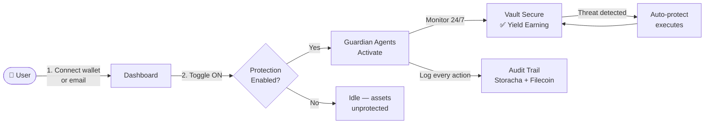
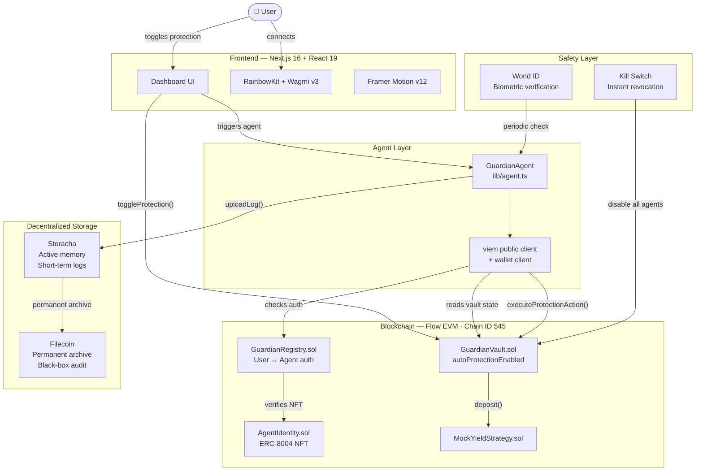
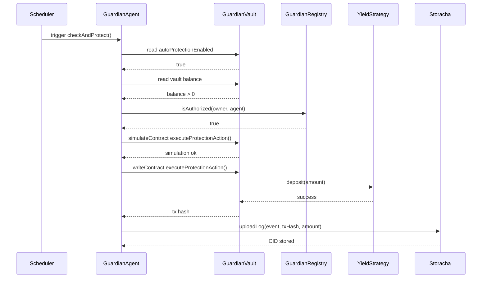

<div align="center">

# HALO
### Autonomous Private Guardian for the Agentic Finance Era

**Your digital wealth. Protected by AI. 24 hours a day. Zero effort.**

[](https://pl-genesis.com)
[](https://developers.flow.com/build/evm)
[](https://nextjs.org)
[](LICENSE)

[Live Demo](https://halo-guardian.dev) · [Demo Video](#) · [Smart Contracts](#smart-contracts) · [Hackathon Submission](#pl_genesis-alignment)

</div>

---

## What is HALO?

HALO is the world's first **Autonomous Private Guardian** — a security and yield layer for your crypto assets, powered by verifiable on-chain AI agents, built on Flow EVM, and designed to feel like Apple Security, not a crypto dApp.

One toggle. Infinite protection.

When you enable HALO, a network of autonomous guardian agents activates. They monitor your vault around the clock, move idle funds into safe yield strategies, detect threats before they materialize, and log every single action permanently on-chain — all without you lifting a finger.

> *"Enable Protection. Sleep peacefully. Let HALO guard your digital life."*

---

## The Problem

**$3.8 billion** was lost to crypto hacks, scams, and human error in 2023 alone. In 2025–2026, that number is accelerating.

| Pain Point | Reality |
|---|---|
| 🔓 Security | Wallets sit exposed. One phishing link ends everything. |
| 😰 Complexity | DeFi requires constant manual attention — yields expire, positions liquidate |
| 🤖 No Automation | Existing bots are opaque, unverifiable, and dangerous to trust |
| 👁️ No Privacy | Every on-chain action is front-runnable and publicly trackable |
| 🧠 Cognitive Load | Managing crypto is a second job most people didn't sign up for |

Existing solutions fail users:
- **Hardware wallets** — secure but fully manual
- **Yield aggregators** — automated but opaque and risky
- **Trading bots** — powerful but require technical expertise and blind trust
- **Custodial services** — simple but you don't own your keys

None of them combine simplicity, autonomy, privacy, and verifiability in one product. Until now.

---

## The Solution

HALO is a premium web dashboard that activates "Autonomous Protection" with a single toggle.

### Core User Flow



It feels like a high-end SaaS security product. Think **Cloudflare meets Apple Security**, built on blockchain.

---

## What Makes HALO Unique

Most crypto projects build trading bots or yield optimizers. HALO builds a **security primitive for the agentic finance era**.

Key differentiators:
- **Agent-native by design** — Agents have verifiable on-chain identities via ERC-8004, not just anonymous scripts
- **Human-first safety** — Kill switch, World ID biometric verification, and full audit trail keep humans in control
- **Privacy-preserving** — Actions execute inside Flow's private enclave; no front-running possible
- **Composable** — GuardianVault and GuardianRegistry are open primitives any developer can build on
- **Beautiful UX** — The first DeFi security product that doesn't look like a terminal

---

## Market Opportunity

| Signal | Data |
|---|---|
| 💰 Total crypto market cap | $2.8T+ (2025) |
| 🔐 Annual losses to hacks/scams | $3.8B+ per year |
| 🤖 AI agent economy projected value | $47B by 2030 (Grand View Research) |
| 📱 Next billion crypto users | Non-technical, mobile-first, need simplicity |
| ⚡ Flow EVM growth | 400%+ YoY testnet activity |
| 🌍 DeFi total value locked | $180B+ actively seeking yield |

The long-term play: HALO becomes the **trust layer for autonomous finance** — the infrastructure every AI agent uses to prove it acted safely and correctly.

---

## Architecture

### System Overview



### Agent Execution Flow



### Smart Contracts

Deployed on **Flow EVM Testnet**

NEXT_PUBLIC_AGENT_IDENTITY_ADDRESS=0x6b542A9361A7dd16c0b6396202A192326154a1e2
NEXT_PUBLIC_GUARDIAN_REGISTRY_ADDRESS=0xa4F78fbf10440afEa067A8fc5391d87f78919107
NEXT_PUBLIC_MOCK_YIELD_STRATEGY_ADDRESS=0x61CBf3d0706a0780c5eEdB6b57D5B539C185Ae8C
NEXT_PUBLIC_INITIAL_VAULT_ADDRESS=0x2f4C507343fC416eAD53A1223b7d344E1e90eeC4


### Tech Stack

| Layer | Technology |
|---|---|
| Frontend | Next.js 16 + React 19 |
| Styling | Tailwind CSS v4 |
| Animation | Framer Motion v12 |
| Web3 | Wagmi v3 + RainbowKit v2 + viem |
| Blockchain | Flow EVM (Chain ID 545) |
| Agent Identity | ERC-8004 via ERC-721 (OpenZeppelin v5) |
| Active Memory | Storacha (`@storacha/client`) |
| Audit Log | Filecoin Calibration Testnet |
| Human Safety | World ID (`@worldcoin/idkit`) |
| Contracts | Hardhat + OpenZeppelin |
| Smooth Scroll | Lenis |

---

## Technology Deep Dive

### Flow — The Backbone

- **Account Abstraction** — Users onboard with email or passkey. No seed phrases. No gas confusion.
- **Scheduled Transactions** — Cadence's native scheduling lets agents execute at precise intervals without a centralized cron server
- **EVM Compatibility** — Full Solidity support on Chain ID 545, so Hardhat, viem, and wagmi work out of the box
- **Speed + Cost** — Sub-second finality and near-zero gas fees make micro-actions economically viable

### ERC-8004 — Agent Identity

Every HALO guardian agent is a verifiable on-chain entity, not an anonymous script.

```solidity
// AgentIdentity.sol
function mintAgent(address _to, string memory _tokenURI) public onlyOwner returns (uint256) {
    uint256 newItemId = _tokenIds++;
    _mint(_to, newItemId);
    _setTokenURI(newItemId, _tokenURI); // Points to agent.json manifest
    emit AgentMinted(_to, newItemId, _tokenURI);
    return newItemId;
}
```

### Storacha — Agent Memory

```typescript
// lib/storacha.ts
async uploadLog(log: any) {
  const file = new File([JSON.stringify(log)], `agent_log_${Date.now()}.json`);
  const root = await this.client.uploadFile(file);
  return root; // CID stored permanently
}
```

### World ID — Human Guardianship

If the human owner doesn't verify their identity via World ID within a set period, HALO automatically pauses all autonomous actions. AI agents can never act indefinitely without human confirmation.

---

## Getting Started

### Prerequisites

- Node.js 20+
- MetaMask browser extension
- Flow EVM Testnet FLOW — [get from faucet](https://faucet.flow.com/fund-account)

### Install

```bash
git clone https://github.com/your-username/halo
cd halo
npm install
```

### Environment

```env
PRIVATE_KEY=your_deployer_private_key
NEXT_PUBLIC_WALLETCONNECT_PROJECT_ID=your_walletconnect_project_id
WORLD_ID_APP_ID=app_staging_xxxxxxxx

NEXT_PUBLIC_AGENT_IDENTITY_ADDRESS=0x6b542A9361A7dd16c0b6396202A192326154a1e2
NEXT_PUBLIC_GUARDIAN_REGISTRY_ADDRESS=0xa4F78fbf10440afEa067A8fc5391d87f78919107
NEXT_PUBLIC_MOCK_YIELD_STRATEGY_ADDRESS=0x61CBf3d0706a0780c5eEdB6b57D5B539C185Ae8C
NEXT_PUBLIC_INITIAL_VAULT_ADDRESS=0x2f4C507343fC416eAD53A1223b7d344E1e90eeC4
```

### Run

```bash
npm run dev      # localhost:3000
npm run build    # production build
```

### Deploy Contracts (already live on testnet)

```bash
npx hardhat run scripts/deploy.ts --network flowTestnet
```

---

## PL_Genesis Alignment

Built for **PL_Genesis: Frontiers of Collaboration Hackathon 2026**

| Bounty | Value | How HALO qualifies |
|---|---|---|
| 🥇 Flow: Future of Finance | Primary | GuardianVault + autonomous agents on Flow EVM 545 |
| 🤖 Agent Only: Let the agent cook | $8,000 | ERC-8004 identity, autonomous execution loop, agent.json manifest |
| ️ Storacha | Secondary | Agent working memory via `@storacha/client` |
|  Filecoin | Secondary | Permanent black-box audit trail on Calibration testnet |
| 🌍 World ID | Secondary | Biometric dead-man's switch via `@worldcoin/idkit` |

---

## Team

Built by **[Your Name]** for PL_Genesis 2026.

> *"We didn't build another DeFi app. We built the security primitive that all future DeFi apps will need."*

---

<div align="center">

**HALO** — Autonomous Private Guardian

*Made with ❤️ for Protocol Labs, Flow, and the future of safe autonomous finance.*

[⬆ Back to top](#halo)

</div>
